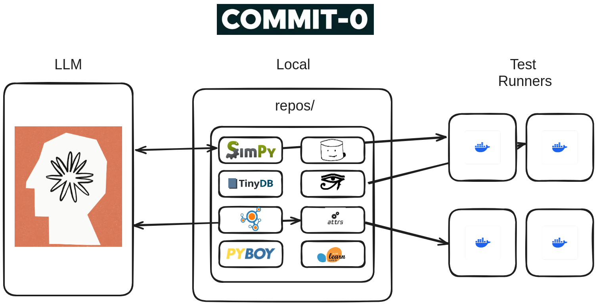

#

## Overview

Commit-0 is a from scratch AI coding challenge.
Can you create a library from commit 0?

The benchmark consists of 54 core Python libraries.
The challenge is to rebuild these libraries and
pass their unit tests.  All libraries have:

* Significant test coverage
* Detailed specification and documentation
* Lint and type checking

Commit-0 is an interactive environment that makes it easy
to design and test new agents. You can:

* Efficiently run tests in isolated environments
* Distribute testing and development across cloud systems
* Track and log all changes made throughout.

To install run:

```bash
pip install -U commit0
```

## Architecture




## Libraries

|  | Name |  Repo | Commit0 | Tests |  |
|--|--------|-------|----|----|------|
|  | [minitorch](https://minitorch.github.io/) | [[orig](http://github.com/minitorch/minitorch)] | [[commit0](http://github.com/commit-0/minitorch)] | 230 |  |
|  | [simpy](https://simpy.readthedocs.io/en/4.1.1/) | [[orig](http://github.com/wenting-zhao/simpy)] | [[commit0](http://github.com/commit-0/simpy)] | 140 |  |
|  | [bitstring](https://bitstring.readthedocs.io/en/stable/) | [[orig](http://github.com/scott-griffiths/bitstring)] | [[commit0](http://github.com/commit-0/bitstring)] | 834 |  |
|  | [tinydb](https://tinydb.readthedocs.io/_/downloads/en/v4.8.0/pdf/) | [[orig](http://github.com/msiemens/tinydb)] | [[commit0](http://github.com/commit-0/tinydb)] | 201 |  |
|  | [marshmallow](https://marshmallow.readthedocs.io/_/downloads/en/stable/pdf/) | [[orig](http://github.com/marshmallow-code/marshmallow)] | [[commit0](http://github.com/commit-0/marshmallow)] | 1229 |  |
|  | [python-prompt-toolkit](https://python-prompt-toolkit.readthedocs.io/_/downloads/en/3.0.43/pdf/) | [[orig](http://github.com/prompt-toolkit/python-prompt-toolkit)] | [[commit0](http://github.com/commit-0/python-prompt-toolkit)] | 151 |  |
|  | [parsel](https://parsel.readthedocs.io/_/downloads/en/latest/pdf/) | [[orig](http://github.com/scrapy/parsel)] | [[commit0](http://github.com/commit-0/parsel)] | 343 |  |
| <b>pyjwt</b> | [pyjwt](https://pyjwt.readthedocs.io/_/downloads/en/2.8.0/pdf/) | [[orig](http://github.com/jpadilla/pyjwt)] | [[commit0](http://github.com/commit-0/pyjwt)] | 259 |  |
|  | [networkx](https://networkx.org/documentation/networkx-3.3/) | [[orig](http://github.com/networkx/networkx)] | [[commit0](http://github.com/commit-0/networkx)] | 5440 |  |
|  | [graphene](https://docs.graphene-python.org/en/stable/) | [[orig](http://github.com/graphql-python/graphene)] | [[commit0](http://github.com/commit-0/graphene)] | 447 |  |
| <b>tlslite-ng</b> | [tlslite-ng](https://tlslite-ng.readthedocs.io/en/latest/) | [[orig](http://github.com/tlsfuzzer/tlslite-ng)] | [[commit0](http://github.com/commit-0/tlslite-ng)] | 1653 |  |
| <b>wcwidth</b> | [wcwidth](https://wcwidth.readthedocs.io/en/stable/) | [[orig](http://github.com/jquast/wcwidth)] | [[commit0](http://github.com/commit-0/wcwidth)] | 38 |  |
| <b>chardet</b> | [chardet](https://chardet.readthedocs.io/_/downloads/en/stable/pdf/) | [[orig](http://github.com/chardet/chardet)] | [[commit0](http://github.com/commit-0/chardet)] | 376 |  |
| <b>dnspython</b> | [dnspython](https://dnspython.readthedocs.io/en/stable/) | [[orig](http://github.com/rthalley/dnspython)] | [[commit0](http://github.com/commit-0/dnspython)] | 1304 |  |
| <b>imapclient</b> | [imapclient](https://imapclient.readthedocs.io/en/3.0.1/) | [[orig](http://github.com/mjs/imapclient)] | [[commit0](http://github.com/commit-0/imapclient)] | 267 |  |
|  | [virtualenv](https://virtualenv.pypa.io/en/20.26.3/) | [[orig](http://github.com/pypa/virtualenv)] | [[commit0](http://github.com/commit-0/virtualenv)] | 284 |  |
| <b>pexpect</b> | [pexpect](https://pexpect.readthedocs.io/_/downloads/en/stable/pdf/) | [[orig](http://github.com/pexpect/pexpect)] | [[commit0](http://github.com/commit-0/pexpect)] | 255 |  |
|  | [web3.py](https://web3py.readthedocs.io/_/downloads/en/v6.20.2/pdf/) | [[orig](http://github.com/ethereum/web3.py)] | [[commit0](http://github.com/commit-0/web3.py)] | 40433 |  |
|  | [babel](https://babel.pocoo.org/_/downloads/en/stable/pdf/) | [[orig](http://github.com/python-babel/babel)] | [[commit0](http://github.com/commit-0/babel)] | 5663 |  |
|  | [geopandas](https://geopandas.org/en/stable/) | [[orig](http://github.com/geopandas/geopandas)] | [[commit0](http://github.com/commit-0/geopandas)] | 2196 |  |
| <b>dulwich</b> | [dulwich](https://dulwich.readthedocs.io/_/downloads/en/latest/pdf/) | [[orig](http://github.com/jelmer/dulwich)] | [[commit0](http://github.com/commit-0/dulwich)] | 1522 |  |
|  | [flask](https://flask.palletsprojects.com/en/3.0.x/) | [[orig](http://github.com/pallets/flask)] | [[commit0](http://github.com/commit-0/flask)] | 477 |  |
| <b>voluptuous</b> | [voluptuous](https://alecthomas.github.io/voluptuous/docs/_build/html/) | [[orig](http://github.com/alecthomas/voluptuous)] | [[commit0](http://github.com/commit-0/voluptuous)] | 149 |  |
|  | [jinja](https://jinja.palletsprojects.com/en/3.1.x/) | [[orig](http://github.com/pallets/jinja)] | [[commit0](http://github.com/commit-0/jinja)] | 851 |  |
|  | [seaborn](https://seaborn.pydata.org/) | [[orig](http://github.com/mwaskom/seaborn)] | [[commit0](http://github.com/commit-0/seaborn)] | 2362 |  |
| <b>requests</b> | [requests](https://requests.readthedocs.io/_/downloads/en/latest/pdf/) | [[orig](http://github.com/psf/requests)] | [[commit0](http://github.com/commit-0/requests)] | 590 |  |
|  | [scrapy](https://docs.scrapy.org/_/downloads/en/2.11/pdf/) | [[orig](http://github.com/scrapy/scrapy)] | [[commit0](http://github.com/commit-0/scrapy)] | 2904 |  |
|  | [fastapi](https://fastapi.tiangolo.com/reference/) | [[orig](http://github.com/fastapi/fastapi)] | [[commit0](http://github.com/commit-0/fastapi)] | 2013 |  |
|  | [click](https://click.palletsprojects.com/en/8.1.x/) | [[orig](http://github.com/pallets/click)] | [[commit0](http://github.com/commit-0/click)] | 589 |  |
|  | [python-rsa](https://stuvel.eu/python-rsa-doc/) | [[orig](http://github.com/sybrenstuvel/python-rsa)] | [[commit0](http://github.com/commit-0/python-rsa)] | 86 |  |
|  | [statsmodels](https://www.statsmodels.org/stable/) | [[orig](http://github.com/statsmodels/statsmodels)] | [[commit0](http://github.com/commit-0/statsmodels)] | 17669 |  |
| <b>more-itertools</b> | [more-itertools](https://more-itertools.readthedocs.io/en/v10.4.0/) | [[orig](http://github.com/more-itertools/more-itertools)] | [[commit0](http://github.com/commit-0/more-itertools)] | 662 |  |
|  | [moviepy](https://zulko.github.io/moviepy/) | [[orig](http://github.com/Zulko/moviepy)] | [[commit0](http://github.com/commit-0/moviepy)] | 109 |  |
| <b>deprecated</b> | [deprecated](https://deprecated.readthedocs.io/en/latest/) | [[orig](http://github.com/laurent-laporte-pro/deprecated)] | [[commit0](http://github.com/commit-0/deprecated)] | 171 |  |
|  | [pydantic](https://docs.pydantic.dev/2.8/) | [[orig](http://github.com/pydantic/pydantic)] | [[commit0](http://github.com/commit-0/pydantic)] | 5091 |  |
|  | [loguru](https://loguru.readthedocs.io/_/downloads/en/0.7.2/pdf/) | [[orig](http://github.com/Delgan/loguru)] | [[commit0](http://github.com/commit-0/loguru)] | 1461 |  |
|  | [pypdf](https://pypdf.readthedocs.io/_/downloads/en/4.3.1/pdf/) | [[orig](http://github.com/py-pdf/pypdf)] | [[commit0](http://github.com/commit-0/pypdf)] | 911 |  |
|  | [attrs](https://www.attrs.org/en/24.2.0/) | [[orig](http://github.com/python-attrs/attrs)] | [[commit0](http://github.com/commit-0/attrs)] | 1414 |  |
|  | [mimesis](https://mimesis.name/en/v17.0.0/) | [[orig](http://github.com/lk-geimfari/mimesis)] | [[commit0](http://github.com/commit-0/mimesis)] | 6159 |  |
|  | [cookiecutter](https://cookiecutter.readthedocs.io/_/downloads/en/2.6.0/pdf/) | [[orig](http://github.com/cookiecutter/cookiecutter)] | [[commit0](http://github.com/commit-0/cookiecutter)] | 367 |  |
|  | [tornado](https://www.tornadoweb.org/_/downloads/en/stable/pdf/) | [[orig](http://github.com/tornadoweb/tornado)] | [[commit0](http://github.com/commit-0/tornado)] | 1150 |  |
|  | [imbalanced-learn](https://imbalanced-learn.org/stable/) | [[orig](http://github.com/scikit-learn-contrib/imbalanced-learn)] | [[commit0](http://github.com/commit-0/imbalanced-learn)] | 2310 |  |
|  | [python-progressbar](https://progressbar-2.readthedocs.io/_/downloads/en/stable/pdf/) | [[orig](http://github.com/wolph/python-progressbar)] | [[commit0](http://github.com/commit-0/python-progressbar)] | 385 |  |
|  | [PyBoy](https://docs.pyboy.dk/) | [[orig](http://github.com/Baekalfen/PyBoy)] | [[commit0](http://github.com/commit-0/PyBoy)] | 201 |  |
|  | [pytest](https://docs.pytest.org/_/downloads/en/8.3.x/pdf/) | [[orig](http://github.com/pytest-dev/pytest)] | [[commit0](http://github.com/commit-0/pytest)] | 3612 |  |
|  | [pylint](https://pylint.readthedocs.io/en/v3.2.6/) | [[orig](http://github.com/pylint-dev/pylint)] | [[commit0](http://github.com/commit-0/pylint)] | 1878 |  |
|  | [sphinx](https://www.sphinx-doc.org/en/master/) | [[orig](http://github.com/sphinx-doc/sphinx)] | [[commit0](http://github.com/commit-0/sphinx)] | 2187 |  |
|  | [joblib](https://joblib.readthedocs.io/en/stable/) | [[orig](http://github.com/joblib/joblib)] | [[commit0](http://github.com/commit-0/joblib)] | 1450 |  |
|  | [xarray](https://docs.xarray.dev/en/v2024.07.0/) | [[orig](http://github.com/pydata/xarray)] | [[commit0](http://github.com/commit-0/xarray)] | 15643 |  |
| <b>cachetools</b> | [cachetools](https://cachetools.readthedocs.io/en/v5.5.0/) | [[orig](http://github.com/tkem/cachetools)] | [[commit0](http://github.com/commit-0/cachetools)] | 215 |  |
| <b>paramiko</b> | [paramiko](https://www.paramiko.org/) | [[orig](http://github.com/paramiko/paramiko)] | [[commit0](http://github.com/commit-0/paramiko)] | 557 |  |
|  | [fabric](https://www.fabfile.org/) | [[orig](http://github.com/fabric/fabric)] | [[commit0](http://github.com/commit-0/fabric)] | 353 |  |
|  | [filesystem_spec](https://filesystem-spec.readthedocs.io/en/stable/) | [[orig](http://github.com/fsspec/filesystem_spec)] | [[commit0](http://github.com/commit-0/filesystem_spec)] | 698 |  |
| <b>jedi</b> | [jedi](https://jedi.readthedocs.io/en/stable/) | [[orig](http://github.com/davidhalter/jedi)] | [[commit0](http://github.com/commit-0/jedi)] | 3854 |  |
| <b>sqlparse</b> | [sqlparse](https://sqlparse.readthedocs.io/en/stable/) | [[orig](http://github.com/andialbrecht/sqlparse)] | [[commit0](http://github.com/commit-0/sqlparse)] | 461 |  |
|  | [portalocker](https://portalocker.readthedocs.io/en/stable/) | [[orig](http://github.com/wolph/portalocker)] | [[commit0](http://github.com/commit-0/portalocker)] | 38 |  |
